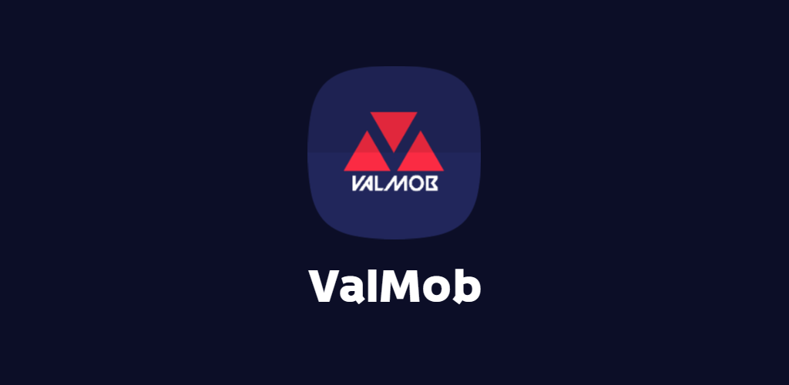

# ValMob - Valorant Esports Scheduling App

ValMob is an Android application created using Flutter and designed to provide users with up-to-date information about Valorant esports tournaments, matches, statistics, and news. This app aims to keep Valorant and Valorant Esports enthusiasts informed and engaged with the latest happenings in the competitive gaming scene.

## Features

1. **Tournament Schedule**: ValMob displays a comprehensive schedule of upcoming Valorant tournaments, including their dates, times, and participating teams. Users can easily browse through the schedule to find the events they are interested in.

2. **Live Match Updates**: ValMob provides real-time updates during ongoing Valorant matches. Users can access live scores, game statistics, and other relevant information to stay engaged with the action.

3. **Match Results and VODs**: ValMob provides match results and VODs in streams for completed Valorant matches. Users can catch up on the action they missed and relive the exciting moments from past tournaments or matches.

4. **News Updates**: ValMob keeps users up to date with the latest news from the Valorant esports industry. Users can access news articles, interviews, and analysis to stay informed about the happenings in the community.

## Contact

If you have any questions, suggestions, or feedback regarding ValMob, please contact me at adityaroy083@gmail.com.

Happy gaming!

